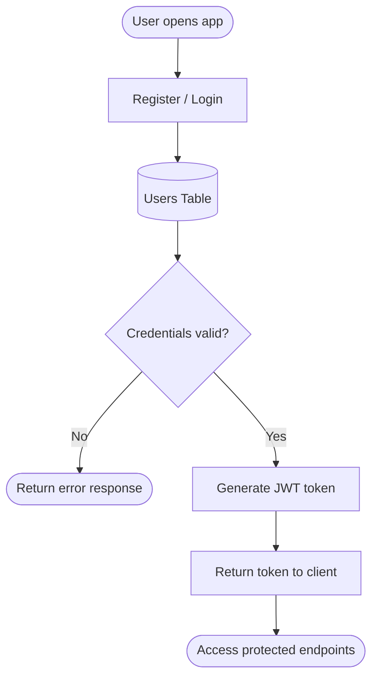
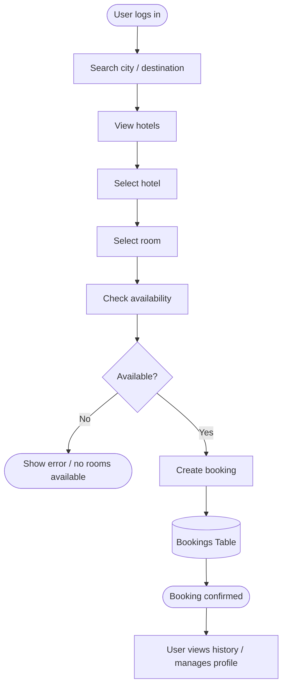

<div align="center">


# BookNest User — Backend API

**RESTful backend for the client-side hotel reservation experience of the BookNest platform**

[](https://www.java.com)
[](https://spring.io/projects/spring-boot)
[](https://www.postgresql.org)
[](https://jwt.io)
[](https://swagger.io)
[](https://cloudinary.com)
[](LICENSE)

</div>

---

## 📌 Overview

**BookNest User Backend** is the server-side engine that powers the **client-side user experience** of the BookNest hotel reservation system.

It is designed exclusively for **end users / clients** and covers the complete booking journey, including:

- user registration and secure login
- hotel search and browsing
- room availability checking
- booking creation and cancellation
- profile management
- booking history tracking
- hotel reviews and ratings
- image delivery and upload integration via **Cloudinary**

This repository **does not include** hotel owner, hotel manager, or administrator functionality. Its scope is limited to the **customer-facing side** of the platform.

The backend is built with a **clean layered architecture** and follows RESTful design principles to keep the codebase modular, maintainable, and scalable.

---

## 🏗️ System Architecture

<p align="center">
  
</p>

The application follows a strict **layered architecture**:

```text
Client / Mobile App
        │
        ▼ HTTPS + JSON
┌───────────────────────────────┐
│ Spring Security + JWT         │  ← Authentication & Authorization
└───────────────┬───────────────┘
                ▼
┌───────────────────────────────┐
│ Controller Layer              │  ← REST endpoints, request validation
└───────────────┬───────────────┘
                ▼
┌───────────────────────────────┐
│ Service Layer                 │  ← Business logic, workflows, rules
└───────────────┬───────────────┘
                ▼
┌───────────────────────────────┐
│ Repository Layer (JPA)        │  ← Data access abstraction
└───────────────┬───────────────┘
                ▼
┌───────────────────────────────┐
│ PostgreSQL Database           │  ← Persistent storage
└───────────────────────────────┘

External Services:
- Cloudinary → image storage and image URL generation
- Swagger / OpenAPI → API documentation
```

**Core architectural concerns** shared across the project:

- validation
- exception handling
- logging
- DTO mapping
- response wrapping
- CORS configuration
- security configuration

---

## 🔐 Authentication Flow



**Security features implemented:**

| Feature | Implementation |
|---------|----------------|
| Password hashing | BCrypt |
| Token strategy | JWT (stateless) |
| Authorization | Role-based access control |
| Request security | Spring Security filter chain |
| Public/private endpoints | Configured by route and role |

---

## 🧭 User Booking Flow



---

## 📦 Business Modules

### 1. 🔐 Authentication & Account Management
- user registration
- secure login with JWT
- token validation
- password encryption
- profile access control

### 2. 🏨 Hotel Discovery
- search hotels by city, name, or filters
- view hotel details and amenities
- show hotel images via Cloudinary
- support location-based browsing

### 3. 🛏️ Room Management for Users
- view available rooms
- inspect room type, price, capacity, and facilities
- check date-based availability
- see room images and descriptive details

### 4. 📅 Booking Management
- create new reservations
- cancel existing bookings
- retrieve booking details
- list past and active bookings
- manage booking status lifecycle

### 5. 👤 Profile Management
- update personal information
- change contact details
- review account activity
- maintain user preferences

### 6. ⭐ Reviews & Ratings
- submit reviews after booking
- rate hotels and/or rooms
- fetch user review history
- display public rating summaries

### 7. 🖼️ Media Management
- upload hotel and room images to Cloudinary
- store and retrieve image URLs
- keep the database lightweight by avoiding binary image storage

### 8. 📊 User Activity & Booking History
- view reservation history
- track current and past bookings
- show user-related interactions in a consistent format

---

## 🧱 Layered Project Structure

| Layer | Responsibility |
|-------|----------------|
| Controller | REST API endpoints, request/response handling |
| Service | Business logic, rules, orchestration |
| Repository | Database access via Spring Data JPA |
| Entity | JPA models mapped to relational tables |
| DTO | Request/response data transfer objects |
| Security | JWT, filters, authentication, authorization |
| Common | Exception handling, utils, config, validation |

---

## 🗃️ Database Schema Overview

Below is the core domain model expected for the user-side backend.

| Table | Purpose |
|-------|---------|
| `users` | Stores user accounts and profile data |
| `roles` | Defines user roles such as `USER` |
| `cities` | Stores searchable destinations |
| `hotels` | Stores hotel metadata and summaries |
| `rooms` | Stores room definitions, price, capacity, and status |
| `bookings` | Stores reservation records |
| `booking_items` | Stores booking room details when needed |
| `reviews` | Stores user ratings and feedback |
| `room_images` | Stores room image metadata and Cloudinary URLs |
| `hotel_images` | Stores hotel image metadata and Cloudinary URLs |
| `favorites` | Optional saved hotels list for users |
| `payments` | Optional payment records if payment is modeled in this backend |

### Suggested entity relationships

- one `user` has many `bookings`
- one `user` has many `reviews`
- one `hotel` belongs to one `city`
- one `hotel` has many `rooms`
- one `room` can have many `room_images`
- one `hotel` can have many `hotel_images`
- one `booking` can contain one or more rooms depending on the reservation design
- one `booking` can have one status lifecycle

### Common booking fields

- booking id
- user id
- hotel id
- room id
- check-in date
- check-out date
- total nights
- total price
- booking status
- created at
- updated at

### Common room fields

- room number / code
- room type
- price per night
- capacity
- availability status
- facilities
- description
- image URLs

---

## 🛠️ Tech Stack

| Layer | Technology |
|-------|------------|
| Language | Java 17 |
| Framework | Spring Boot 3.x |
| Security | Spring Security + JWT |
| ORM | Spring Data JPA / Hibernate |
| Primary Database | PostgreSQL |
| Image Storage | Cloudinary |
| API Documentation | Swagger / OpenAPI |
| API Testing | Postman |
| Build Tool | Gradle / Maven |

---

## 🧩 API Capability Summary

| Area | Typical Endpoints |
|------|-------------------|
| Authentication | register, login, refresh token, logout |
| Profile | get profile, update profile, change password |
| Hotels | search hotels, get hotel by id, list featured hotels |
| Rooms | get rooms by hotel, check availability, get room details |
| Booking | create booking, cancel booking, get booking history |
| Reviews | add review, list reviews, user review history |
| Media | upload image, get image URL, attach images to hotel/room |

---

## 📁 Project Structure

```text
BookNest-User-Backend/
├── src/
│   └── main/
│       ├── java/com/booknest/user/
│       │   ├── auth/            # registration, login, JWT, security
│       │   ├── user/            # user profile management
│       │   ├── hotel/           # hotel browsing and details
│       │   ├── room/            # room details and availability
│       │   ├── booking/         # booking creation, cancellation, history
│       │   ├── review/          # ratings and reviews
│       │   ├── media/           # Cloudinary upload and image handling
│       │   ├── city/            # searchable destinations
│       │   └── common/          # exception, validation, config, utils
│       └── resources/
│           └── application.properties
└── build.gradle / pom.xml
```

---

## ⚙️ Setup & Run

### Prerequisites
- Java 17+
- PostgreSQL database
- Cloudinary account
- Spring Boot compatible build tool setup

### 1. Clone the repository
```bash
git clone <YOUR_REPOSITORY_URL>
cd BookNest-User-Backend
```

### 2. Configure `application.properties`

```properties
# Server
server.port=8080

# PostgreSQL
spring.datasource.url=jdbc:postgresql://localhost:5432/booknest_user
spring.datasource.username=YOUR_DB_USERNAME
spring.datasource.password=YOUR_DB_PASSWORD
spring.jpa.hibernate.ddl-auto=update
spring.jpa.show-sql=true
spring.jpa.properties.hibernate.format_sql=true

# JWT
jwt.secret=YOUR_JWT_SECRET_KEY
jwt.expiration=86400000

# Cloudinary
cloudinary.cloud-name=YOUR_CLOUD_NAME
cloudinary.api-key=YOUR_API_KEY
cloudinary.api-secret=YOUR_API_SECRET

# Swagger
springdoc.api-docs.path=/api-docs
springdoc.swagger-ui.path=/swagger-ui.html
```

### 3. Run the application

```bash
./mvnw spring-boot:run
```

or

```bash
./gradlew bootRun
```

### 4. Access the application
- API base URL: `http://localhost:8080`
- Swagger UI: `http://localhost:8080/swagger-ui.html`
- OpenAPI JSON: `http://localhost:8080/api-docs`

---

## 🧪 API Documentation

The project is expected to expose its endpoints through **Swagger / OpenAPI**, making it easier to:

- inspect available endpoints
- test requests directly from browser
- verify request/response DTOs
- document authentication flow
- validate booking and review workflows

---

## 🎯 Design Principles

- **Client-side focus** — only end-user features are included
- **Clean layered architecture** — strict separation of concerns
- **RESTful API design** — predictable and consistent endpoints
- **Security-first approach** — JWT-protected private routes
- **Modular structure** — each domain is isolated and maintainable
- **Cloud-native media handling** — images stored externally in Cloudinary
- **Scalable data access** — Spring Data JPA with normalized relational modeling

---

## 🧠 What This Project Demonstrates

This project reflects practical experience in:

- designing a production-style hotel reservation backend
- implementing secure authentication with JWT
- modeling users, hotels, rooms, bookings, and reviews in PostgreSQL
- integrating external media storage through Cloudinary
- building maintainable Spring Boot applications with layered design
- documenting APIs with Swagger/OpenAPI
- supporting a user-centric booking workflow from search to confirmation

---

## 🔗 Related Frontend / Mobile Project

| Project | Description | Link |
|---------|-------------|------|
| 📱 BookNest App | Client-facing application for hotel search and booking | `<ADD_YOUR_LINK_HERE>` |

---

## 👩‍💻 Author

**Melika Shooryabi**  
Java Backend Developer · Android Developer

[](https://github.com/Melikash98)

---

## 📄 License

This project is licensed under the **MIT License**.

<div align="center">

Made with ❤️ — the user-side backend of the BookNest ecosystem

</div>

